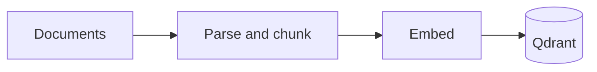
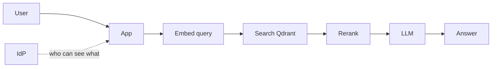

# [ARCHITECTURE.md](http://ARCHITECTURE.md)

## Context

The goal is an internal assistant for a Swiss SME, answering employee questions over HR documents, internal procedures, and security policies. The two hard constraints shaping every choice below are **nFADP compliance (100 % Swiss data residency)** and **simplicity** — this is an internal tool, not a research system, so I sometimes prefer fair and defensible (more optimal to our use case) choices over clever ones.

---

## 1. Document Ingestion

I split ingestion into four concerns: preprocessing, chunking, embeddings, and metadata/re-indexing. The pipeline runs as a nightly batch job on a Swiss VM (details in §4) and feeds the vector store described in §2.

### 1.1 Preprocessing

The corpus will be heterogeneous — native and scanned PDFs, `.docx`, intranet HTML, the occasional spreadsheet or PowerPoint. I would use `**unstructured`** as the main parser because it auto-detects file type and, crucially, returns a typed element tree (`Title`, `NarrativeText`, `Table`, `ListItem`) instead of a flat string. I need that structure in §1.2. For scanned PDFs I add an OCR fallback with `**pytesseract`**, isolated to that specific case so the OCR cost stays bounded.

After extraction I normalise everything to UTF-8 with Unicode NFC so a character like `é` always has the same byte representation, and I strip repeating headers, footers, page numbers, and HTML boilerplate (navigation, scripts, cookie banners) — otherwise they pollute every chunk. Tables I keep, serialised as Markdown, so the LLM can still read their rows and columns downstream.

I detect the dominant language of each document with `**fasttext-langdetect`** and store it as metadata. Swiss SMEs mix FR, DE, IT, and EN, so this lets me either filter retrieval by language or, more often, rely on the multilingual embedder (§1.3) for cross-lingual matching (a French query finding a German chunk).

For deduplication I compute a **SHA-256** hash of each raw file and drop exact duplicates. I pick SHA-256 over MD5 because MD5 has known collisions (it had been broken by attackers); the performance difference is negligible at this scale and SHA-256 is the default expectation of any security review. I could do near-duplicate detection, but it depends on the similarity of the internal procedures, I ahve to have more informations on the SME.

One note on PII: HR documents contain names, AVS numbers, salaries. I keep them inside chunks (authorised employees need to read them), but I never log chunk content in plain text, and chunks inherit the access tags of their source folder so confidential material is gated by RBAC rather than by redaction (see §1.4 and §5).

### 1.2 Chunking

I chose **structure-aware chunking with recursive fallback and title prepending**.

Concretely: the heading tree from `unstructured` gives me one chunk per terminal section. If a section is longer than my target size, I recursively split it on `\n\n → \n → ". " → " "`, always using the most respectful separator that produces pieces under the limit. I prepend the heading path ("HR Handbook > 3. Leave > 3.2 Sick leave") to every chunk, which is nearly free and measurably boosts retrieval because the topical anchor ends up inside the embedding.

**Target size: 500 tokens, with 15 % overlap (75 tokens).** I picked 500 because policy-style prose tends to have "one rule per paragraph of 300–600 tokens" — smaller chunks lose antecedents ("this rule does not apply to..." without the rule), larger chunks dilute the embedding. 500 is the common empirical sweet spot reported in the LangChain and LlamaIndex documentation for this kind of corpus, and it sits comfortably inside the 8 192-token context window of the embedder I picked in §1.3, leaving room for the title prefix. I picked 15 % overlap as the smallest value that reliably catches a rule/exception pair spanning a cut, without inflating storage beyond 15 %.

I rejected **fixed-size chunking** because it ignores structure and routinely cuts mid-sentence or mid-table. I also rejected **pure semantic chunking** (embedding each sentence and merging while similar): it's expensive at ingestion, threshold-sensitive, and gives me nothing on documents that already have explicit headings written by humans.

### 1.3 Embeddings

I need a model that is multilingual (FR / DE / IT / EN), self-hostable on Swiss infrastructure, commercially licensed, and good enough for cross-lingual retrieval. My choice is `**BAAI/bge-m3`**.

What I like about it:

- Apache 2.0 license, so no commercial ambiguity.
- Covers 100+ languages including all four I care about, with strong cross-lingual performance.
- 8 192-token input window, which matches my 500-token chunks plus title prefix with margin to spare.
- 1 024-dim output — enough quality, not enough to bloat the vector store.
- Produces dense **and** sparse vectors simultaneously. **I will only use the dense side today**, but storing the sparse vectors at ingestion keeps the door open to hybrid search in §2 without re-indexing later.

I rejected **OpenAI** `text-embedding-3-large` despite its strong benchmarks because it is a proprietary API: every chunk would leave Switzerland. The only way to keep it Swiss-resident would be Azure OpenAI Switzerland North, which adds cost, vendor lock-in, and a new contractual layer for a marginal accuracy gain I think we don't necessarily need. I rejected `**multilingual-e5-large`** because its 512-token context is tight once the title prefix is added, and it has no sparse output. I rejected `**jina-embeddings-v3`** because its current CC-BY-NC license is ambiguous for commercial internal use.

I serve the model with **Text Embeddings Inference (TEI)** from Hugging Face, in a container on the same Swiss VM as the rest of the stack. It gives me batching and a stable HTTP endpoint without me writing a server from scratch.

One operational commitment: I record the embedding model in each chunk's metadata. Different models live in different vector spaces, so if I ever upgrade the embedder I must re-embed the whole corpus. That record makes the migration explicit instead of silently broken.

### 1.4 Metadata and incremental re-indexing

Every chunk stored in the vector database carries metadata I need for three jobs: citation, access control, and re-indexing.

For **citation**, I keep the source filename, document version, and the heading path of the section the chunk came from. When the LLM answers, it quotes those fields so employees can verify the claim against the original document, which is in my point of view non-negotiable for an internal tool.

For **access control**, each chunk inherits the access tags of its source folder in the document management system, plus a confidentiality level (internal / confidential / restricted). The vector store applies these as a **pre-filter** before similarity search, so a user never retrieves a chunk they are not authorised to see. Details in §5; the point here is that these fields must be set at ingestion, not later, so the cosine-similarity does not run more for nothing (it won't be efficient, and a lot of people make this mistake, here's an extreme example: if only 2 % of chunks are accessible to a user, we might retrieve 100 candidates and be left with 0 matching the filter).

For **re-indexing and compliance**, I store the file's SHA-256 hash, the last-modified and last-ingested timestamps, the chunk's index and total count within its document, and the name of the embedding model that produced the vector. The hash lets me detect changes cheaply; the timestamps let me prove freshness; the chunk indices let me pull neighbouring chunks if the LLM needs more context; the embedding-model field lets me migrate safely.

**Incremental re-indexing** runs as a nightly cron at 02:00 Swiss time — early enough that the morning's users see fresh content, cheap enough that I don't need event-driven infrastructure yet. A small SQLite ledger on the same Swiss VM maps `file_path → last_hash → last_ingested_at`. Four cases per run:

1. File new in source → parse, chunk, embed, insert, add to ledger.
2. File modified (hash changed) → delete all chunks where `source_file` matches, re-process, insert new chunks, update ledger.
3. File unchanged → skip.
4. File deleted from source → delete its chunks from the vector store, remove from ledger.

The same mechanism handles nFADP **right-to-erasure** requests: deletion by `source_file` or `source_hash` is a single query, logged to the audit trail.

### 1.5 End-to-end ingestion loop

```
For each file in the Swiss document source (SharePoint / Nextcloud / shared folder):
  1. Compute SHA-256 hash of the file
  2. Consult ingestion ledger → new / modified / unchanged / deleted
  3. If new or modified:
       a. Parse with unstructured (+ OCR fallback for scanned PDFs)
       b. Normalise (UTF-8, NFC, strip headers/footers, keep tables as Markdown)
       c. Detect language (FR / DE / IT / EN)
       d. Structure-aware chunk (~500 tokens, ~15 % overlap, recursive fallback)
       e. Prepend section-title breadcrumb to each chunk
       f. Embed with BGE-M3 on self-hosted TEI (Swiss VM)
       g. Attach metadata (provenance, freshness, language, access tags, bookkeeping)
       h. Upsert into the vector store (delete old chunks first if modified)
       i. Update the ingestion ledger
  4. If deleted from source: delete all matching chunks + update ledger
Log the run (file counts, timings, errors) to the audit log (Swiss soil).
```

## 2. Vector Store

### 2.1 What I need from the vector store

For this use case I have five criteria, in roughly this order of importance: (1) self-hostable on a Swiss VM, because nFADP rules out any managed cloud outside Switzerland; (2) permissive commercial license — Apache 2.0 or equivalent — so the SME is not forced into re-licensing conversations later; (3) strong metadata pre-filtering, because RBAC (§5) depends on filtering *before* the similarity search, not after; (4) native hybrid-search support so I can enable dense + sparse retrieval later without re-indexing; (5) low operational burden — one container, one volume, one port — because the SME's IT team is small.

### 2.2 My choice: Qdrant, self-hosted, single-node

I would use **Qdrant**, running as a single Docker container on a Swiss VM (§4), with a persistent volume for vector data and periodic snapshots for backup.

Qdrant fits all six criteria without compromise. It is Apache 2.0, written in Rust (so it runs in a single binary and is memory-efficient), and its metadata filtering uses an implementation they call "filterable HNSW" that integrates the filter directly into the graph walk. That matters to me because my RBAC filters are often selective, a given user may only be entitled to a small fraction of the corpus, and in that regime a post-filter approach returns too few matches. Hybrid search (dense + sparse + RRF) is native and behind a single configuration switch, which is exactly the upgrade path I want.

I considered four alternatives and rejected them:

- **Milvus** is engineered for billion-vector workloads with a distributed, multi-component architecture. Over-engineered for my scale (roughly 10⁵–10⁶ chunks).
- **Weaviate** is a strong option with good filters and native hybrid, but operationally heavier than Qdrant (more configuration, more moving parts). I didn't find any quality gain to justify the extra surface area for a SME team.
- **Chroma** is very light to run, but its filter implementation degrades on selective queries and hybrid support is limited. Good for prototypes, not where I'd bet production RBAC.
- **pgvector** (PostgreSQL extension) is genuinely tempting if the SME already runs Postgres: vector search becomes "just another column," and backups, replication, and access control are inherited from a system the IT team already knows. I rejected it here because hybrid search has to be hand-wired (Postgres full-text search + vector column, fused in the application), its HNSW is less tuned than Qdrant's, and filter quality relies on the Postgres query planner. If I later discovered the SME already had a Postgres DBA and a lightweight corpus, I would revisit this decision.

### 2.3 Index and search configuration

I'd configure Qdrant with an **HNSW index** (graph-based approximate nearest-neighbour search) using **cosine similarity** as the metric, consistent with how BGE-M3 was trained. HNSW is the default in Qdrant and trades around one percent of recall for a 10–100× speedup over brute-force search — a very acceptable loss.

Every query carries a **metadata pre-filter** on `access_tags` and, when relevant, `language`. Pre-filtering (as opposed to post-filtering) is non-negotiable here: if a user is only entitled to 5 % of the corpus, a post-filter retrieves the global top-k first and may leave us with zero accessible matches. Qdrant's filterable-HNSW walks the graph only through vectors that already satisfy the filter, which keeps both recall and latency stable regardless of how selective the filter is.

For day-one sizing, a single Qdrant instance with a few GB of RAM handles the SME's expected corpus (~10⁵–10⁶ chunks × 1 024-dim vectors ≈ a few GB of vectors + index) with sub-100 ms query latency. Snapshots are scheduled nightly to the same Swiss storage used for the rest of the stack (§4), which also keeps the disaster-recovery story aligned with nFADP retention rules.

### 2.4 Hybrid search: why dense-only at v1, and how I kept hybrid ready

Dense embeddings alone struggle on rare tokens — form codes, acronyms, policy IDs, proper names — because those strings carry little semantic content and the embedder averages them out. Hybrid search fixes this by running dense retrieval in parallel with a sparse/keyword retrieval (BM25-style) and fusing the two rankings into a single ranked list, typically with **Reciprocal Rank Fusion (RRF)** because it is scale-free and needs no tuning.

I still chose **dense-only for v1**. The corpus is prose — HR policies, procedures, security documents — where paraphrases and synonyms dominate (which is the regime where dense shines). Shipping hybrid on day one would mean tuning a fusion weight against queries I haven't seen yet, which is guesswork. Starting dense-only lets the query logs tell me whether hybrid would actually help before I add the complexity.

What makes this safe rather than lazy is that I already picked BGE-M3, which emits a sparse vector alongside the dense one in the same forward pass (§1.3), and I picked Qdrant, which supports hybrid dense + sparse + RRF natively. Enabling hybrid later is just a configuration change, not a re-indexing.

## 3. LLM Orchestrator

### 3.1 My choice: LlamaIndex, used narrowly

I would use **LlamaIndex**. Its center of gravity is RAG, and its abstractions map almost one-for-one onto the pipeline I described in §§1–2: `Document` and `NodeParser` on the ingestion side, `QdrantVectorStore` with metadata filters and hybrid-ready configuration on the retrieval side, a small `QueryEngine` wrapping retriever + prompt + LLM. Apache 2.0, actively maintained, smaller API surface than LangChain, which is a feature under a "simple and secure" brief.

Concretely, the `QueryEngine` connects the retriever to our self-hosted Qdrant (§2) with a metadata pre-filter built from the authenticated user's RBAC roles and language preference; the embedder to our self-hosted Text Embeddings Inference server running BGE-M3 (§1.3), with the model version read from a single configuration source so query-time and ingest-time embeddings cannot drift apart; and the LLM to the Swiss-hosted endpoint described in §4. A single reviewed system prompt enforces three rules — answer only from the provided context, cite the source of each claim, reply "I don't know" when the context is insufficient — and a logging callback writes the query, retrieved chunk IDs, prompt, and answer to the Swiss-resident audit log on every call.

I considered three alternatives. **LangChain** has a larger ecosystem and excellent tracing with LangSmith, but the hosted version of LangSmith fails nFADP residency, and the framework's broader surface (agents, tool-use, multi-agent graphs) is code I'd have to either ignore or review without needing it. I'd revisit LangChain if the SME later wanted LangSmith-grade observability or agentic workflows. **Haystack** is a solid European alternative with strong evaluation tooling; I see it as the right choice for a larger, more formal procurement context, but LlamaIndex in my point of view gets to "working" faster for an SME with the same code budget. **Plain Python** would minimise surface area but force me to re-implement prompt templating, retries, streaming, tracing, and evaluation scaffolding — a mainstream framework used on a narrow subset is simpler and safer than a hand-rolled equivalent because it is battle-tested.

### 3.2 What I deliberately won't use

No agents, no tool-use, no multi-hop reasoning: letting the LLM decide which tools to call multiplies prompt-injection risk and breaks auditability, and a straight-line retrieve → prompt → generate pipeline is sufficient for our use case. No chain-of-thought exposed to the user. No server-side conversational memory at this first version — each query is stateless, which keeps RBAC, audit, and nFADP retention simple; I'd add short-term memory later only if follow-up questions become a real need, under the same retention rules as the rest of the system.

## 4. 100% Switzerland-based Hosting

nFADP does not literally require data to stay in Switzerland, but the brief does, and it's the cleanest way to avoid cross-border-transfer questions for HR material. I treat "Swiss" as three concurrent conditions: the server sits in a Swiss data centre, the operator is incorporated in Switzerland, and every step of the pipeline stays on that Swiss path. The jurisdiction condition is what excludes AWS, GCP, and Azure Swiss regions: they remain US-incorporated and therefore exposed to the US CLOUD Act, which can compel disclosure regardless of where the server sits. I therefore default to Swiss-owned operators — **Infomaniak** (Geneva) or **Exoscale** (Lausanne), with **Swisscom Cloud** as the heavier option for stricter compliance needs.

The LLM is the highest-stakes hosting choice, so I take it first. I would self-host an open-weights model on a Swiss GPU VM — **Mistral Small** (or Mixtral 8x7B with more budget) served with **vLLM** in a container on Infomaniak or Exoscale. **Apertus** (ETH Zürich / EPFL) is worth evaluating as it matures because it adds a Swiss-origin argument on top of Swiss hosting. Self-hosting gives me full data-path control, a predictable fixed cost, stable model versions, and auditable weights. The quality gap versus GPT-4-class is real but limited in impact here: in a well-engineered RAG the LLM synthesises over retrieved context rather than recalling world knowledge, and mid-size open models perform well in that regime.

I considered **Azure OpenAI Switzerland North** (best quality and Swiss endpoint) but Microsoft remains US-incorporated so CLOUD Act exposure stays a decision only the SME's legal team can accept. I'd keep it as a fallback if the quality gap became a real blocker. 

The rest of the stack runs as Docker containers on Swiss VMs from the same operator: `qdrant` on an encrypted persistent volume, `tei-bge-m3` for embeddings, the LlamaIndex orchestrator with a minimal web API, a small Postgres for the ingestion ledger and audit log, and `caddy` terminating TLS as the only externally reachable component. Everything else sits on a private network. Docker Compose is I think enough at a first version. Observability stays Swiss as well: a self-hosted **Langfuse** on the same VM, not hosted LangSmith or Datadog, otherwise prompts and retrieved chunks would leave the country.

## 5. Security

I would keep RBAC entirely outside the LLM. The SME already has an identity provider (Entra ID or Active Directory), so I'd authenticate users through it via OIDC/SAML and read their group memberships on every query. The orchestrator turns those groups into a metadata pre-filter on `access_tags` when it hits Qdrant, so the search only walks through chunks the user is allowed to see. The tags themselves are inherited from each document's source-folder permissions at ingestion (§1.4), which keeps a single source of truth for access. I'd also check server-side that every chunk ID cited in the answer was actually in the filtered retrieval, so a bad prompt can't sneak a reference to filtered-out content.

For residency, I treat it as a runtime rule, not just a hosting one. I'd configure an outbound firewall allow-list restricted to the Swiss LLM endpoint, the Swiss backup bucket, and OS mirrors — nothing else can leave the network. Audit logs (timestamp, user, query, retrieved chunk IDs, answer) stay on the same Swiss Postgres with a 12-month retention I can adjust per nFADP guidance. nFADP erasure ends up being a one-line query thanks to §1.4: deleting by `source_file` wipes all chunks from a document, and the deletion propagates to the next backup so it can't silently come back.

Beyond that, the non-negotiables: secrets in a secrets manager (never in the repo or images), TLS 1.3 on every connection including internal ones, and prompt injection mitigated by a system prompt that labels retrieved text as untrusted data plus the fact that my orchestrator exposes no tools the model could be tricked into calling (§3). Rate limiting on the web layer and a quarterly access review against the identity provider cover abuse and role drift.

## 6. Hallucinations

The cheapest and highest-leverage defence I'd use is a **strict grounded system prompt**: the LLM is told it must answer only from the retrieved chunks, cite each claim by `source_file` and `section_path`, and reply "I don't know" when the context is insufficient. This cuts most hallucinations because the model is explicitly forbidden from falling back on its pretraining, and importantly the mandatory citation turns every claim into something I can verify.

On top of that, I would add a **cross-encoder reranker** (like `BAAI/bge-reranker-v2-m3`) on the top-k candidates returned by Qdrant. A cross-encoder scores `(query, chunk)` pairs jointly rather than through cosine similarity of independent embeddings, so it is materially more accurate on borderline cases. I'd set a minimum score threshold below which the orchestrator abstains and tells the user the policies don't cover the question — an explicit "no answer" is far safer in an HR context than a confidently wrong one.

Finally, I'd run a **post-generation citation check**: before sending the answer back, the orchestrator verifies that every cited chunk ID was actually in the retrieved context and that the cited text substring appears in that chunk. If the check fails, the answer is rejected and either regenerated once or replaced by an abstain. This closes the loop on the one hallucination pattern the prompt alone cannot stop — the model inventing a plausible-looking citation.

## 7. Pipeline diagram

There are **two** straight-line flows: indexing documents (batch), then answering a question (online). Details stay in §§1–6; the drawings are only the skeleton.

**A — Ingestion:** files are read, turned into chunks, embedded, stored.




**B — Query (for each question):** same embedder as ingestion, search the index, then generate an answer. Login (IdP) tells the app which chunks the user may see.




**C — Where it runs:** TEI, Qdrant, LLM (vLLM), app, Postgres ledger/audit, Caddy — all on **Swiss VMs** (§4). No separate drawing; one place, one jurisdiction.

**D — Reducing bad answers (§6):** grounded system prompt → reranker with an abstain threshold → check citations before returning text.